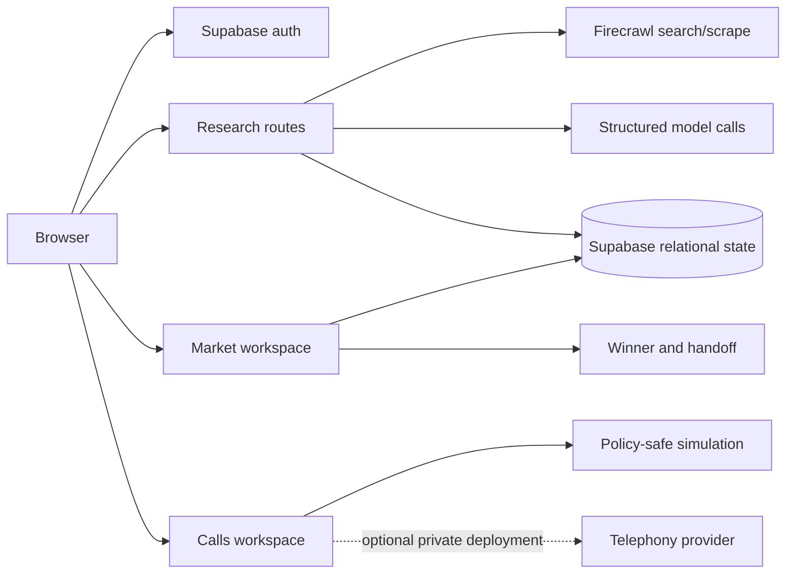

# Switchboard architecture

Switchboard is a Next.js application that turns an unstructured sourcing brief into a reviewable, evidence-backed shortlist and a constrained next step.

## Boundaries

- Browser code receives only public configuration such as Supabase URL and publishable keys.
- Server routes own provider credentials and validate authenticated users before accessing user-owned rows.
- Research evidence is stored with source metadata so a recommendation can be reviewed before an operator acts.
- Hosted review builds keep outbound calling off. Telephony is an explicitly enabled private-deployment capability, not a portfolio demo default.
- External actions should remain mocked or dry-run until an operator confirms the exact action and recipient.

## Main flow

1. `/research` captures a brief and normalizes it into structured fields.
2. Market routes collect public web evidence and persist a traceable run.
3. `/market` presents ranked candidates with evidence and refinement controls.
4. `/calls` shows outreach state; hosted mode uses recorded/simulated lanes.
5. `/winner` records the selected next step and exports a reviewable handoff.

## Failure handling

Provider failures are represented as failed or incomplete states. Recovery scripts are dry-run by default, and the operator must inspect the proposed repair before applying it.
